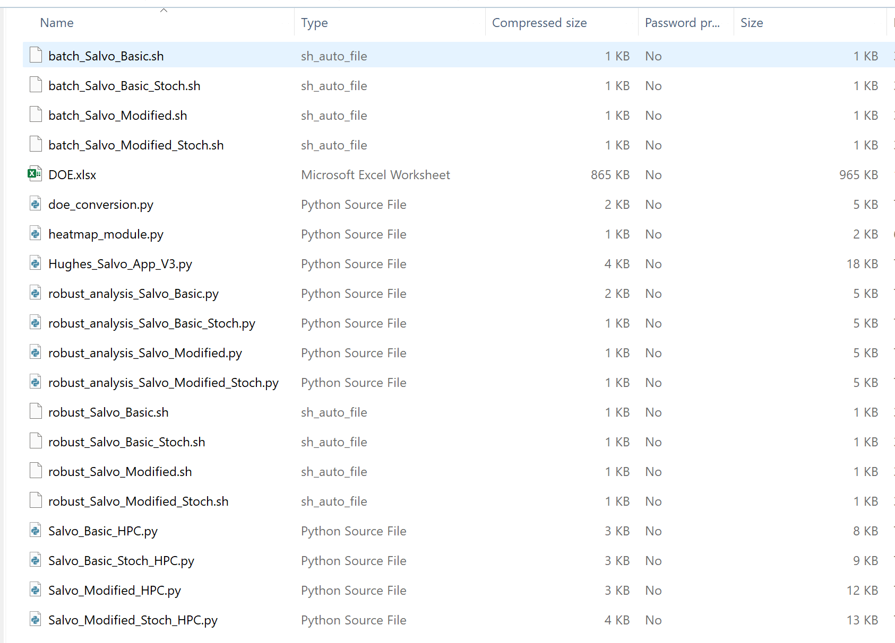

# Comp3_Project_Berner_Galvan_Harris_Salvo_Equations
Final Project for Computational Methods 3 course at Naval Postgraduate School (NPS) under the tutelage of LTC Matthew Smith. This project develops an application to explore Hughes Salvo Equations via battle simulations. 

## Overall Project Objective

## Background information
If you have never taken a class on Lanchester Equations or Salvo equations, you can reference the `HughesSalvoModelPresentation.pdf` presentation that should arm you with the basic knowledge necessary to understand the models. 

## Setup Prerequisites 
1. Ensure you have an NPS Hamming High Performance Computing (HPC) account with username and password.
2. To run this you must either be on the NPS network or GlobalConnect VPN.
3. You must have a virtual environment set up on HPC under the /smallwork folder with a recent **python version (3.11.2 or newer), numpy, pandas, and scipy** loaded. If you do not yet have one, follow these steps to do so:
   - We will be using python venv package (can also set up using Conda package from Anaconda)
     1. Connect to Hamming (see `OA3802_HPC_1_Basics_2024.pptx` in files if you haven't set up an account or ever used Hamming HPC)
     2. From your home directory on HPC, launch an interactive shell with `salloc` and load the desired python version (recommend loading newest one, no earlier than 3.11.2)
     3. Create a new virtual environment named "comp3" with:    `python -m venv /smallwork/$USER/comp3`
         - NPS HPC recommends using /smallwork directory to better handle large number of files created by virtual environments
         - The $USER variables stores current user’s username, so same code will work for any user running it
     4. Activate new environment by running:     `source /smallwork/$USER/comp3/bin/activate`
         - After activating, you should see the new (comp3) environment listed before your prompt. (base) may also appear - this signifies a conda environement (first environement is the active one) 
     5. We can now set up the (comp3) environment by “pip installing” any packages into it. Run `pip list` to view all packages.  If this is a new environment, you won’t see much.
     6. You may have also gotten notice that a new release of pip is available.  If so, go ahead and run the new command, something like `pip install --upgrade pip`
     7. While the (comp3) environment is active, install the following, and then re-run `pip list` to confirm they were installed.
            `pip install numpy`
            `pip install pandas`
            `pip install scipy`
     8. Your enviornment should be stood up now. You can stop using the (comp3) venv by running `deactivate`
     9. If you are still running into issues or need help, please consult LTC Smith's powerpoint on virtual environments (see `OA3802_HPC_4_Virtual_Environments_2024.pptx` in files). It has a test file procedure to tell if it is properly stood up. 
4. Download the files associated with this project into a desired folder location. This application will create new files and store them here.

Useful resources if you still can't get it setup:
- NPS HPC Wiki https://wiki.nps.edu/pages/viewpage.action?spaceKey=HPC&title=Create+a+Python+or+Conda+virtual+environment

## Files associated with this project  
- Download the `Hughes_Salv_App.zip` and extract content to a location of your choosing.
- It should have the following files in it:

## Project Workflow (how to use this streamlit app and what is generally going on behind the scenes)
1. Fulfill the prerequisites above and have the files downloaded to a location of your choosing. (To run the following, you do not need to be actively logged into HPC but you do need to be on the VPN or NPS network).
2. Open a command line interface of your choosing (Windows Powershell, etc.) and run: `streamlit run Hughes_Salvo_App_V3.py`  (If there have been any updates, ensure the version number is updated to whatever is in the zip file)
3. It should automatically open a new tab on your browser to the streamlit app. On the left hand side, it should be prompting you for your HPC username and password. Type those in and hit enter.
   - If successful, you won't see anything, but if it does not successfully connect you should see an error message telling you so at the top of the page.
4. Select the type of model you want to run (Basic, Basic Stochastic, Modified, Modified Stochastic)
5. **(NEED TO FINISH)**

## Visuals
Depending on what you are making, it can be a good idea to include screenshots or even a video (you'll frequently see GIFs rather than actual videos). Tools like ttygif can help, but check out Asciinema for a more sophisticated method.

![Salvo App In Action (salvo_app_in_action.gif)]

## Support
Reach out to any of the authors of this github repo (Captains John Berner, Michael Galvan, and/or Ryan Harris, USMC) or your friendly neighborhood Comp 3 professor. Our nps emails will likely have evaporated by now but you can find us on the USMC locator (ask a Marine to help you). 

## Potential future additions
This methodology should provide a solid framework for if you wish to make a tool that works for other salvo equations or Lanchester-based equations. There will likely need to be some tweaking to the code and the simulation process (changing simultaenous salvos to perhaps sequential for example) but your Comp 3 class should equip you with the skills to do so. There's also always trusty Captain ChatGPT to lend a hand. 

## Contributing
If you do create a new workflow that explores another salvo equation, please feel free to reach out to us and we'd love to update this page with that addition. 

## Acknowledgment
A special thank you to LTC Smith for teaching us some very challenging and new material in a comprehensive and structured way. We owe a lot of future success to the foundations you built for us. Thank you sir!

## License
MIT License: AKA very permissive. But just enough protection so we aren't liable for any real-world force allocation decisions you may or may not base upon this work. 

## Project status
Currently it runs for the four models we simulated (Basic, Basic Stochastic, Modified, Modified Stochastic) and we don't look to add any more ourselves at this time but are open to additons from other users who feel so inclined. 
